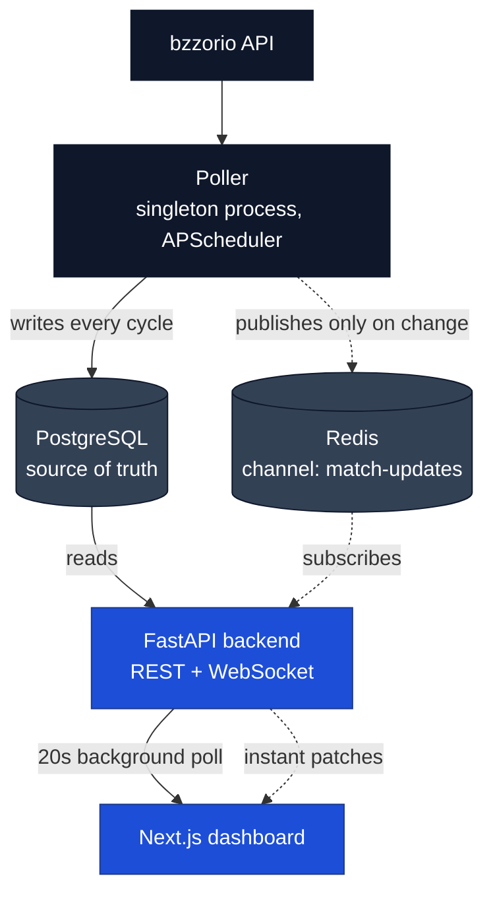

<p align="center">
  
</p>

<h1 align="center">Mezzala — Live Soccer Dashboard</h1>


Mezzala is a live soccer dashboard covering 16 major European competitions — fixtures, standings, and player stat leaderboards, with scores that update while matches are still being played.

**Live demo:** https://mezzala.vercel.app/

---

## Features

- **Live score updates** — in-progress scores and match minutes are pushed to the browser over a WebSocket the moment they change, rather than waiting for the next page refresh.
- **Fixtures two ways** — browse a competition by matchday, or pick a calendar date and see every match across all tracked competitions that day.
- **Standings with zone highlighting** — full league tables with qualification and relegation zones colour-coded against each competition's own legend.
- **Player stat leaderboards** — five ranked boards per competition: goals, assists, yellow cards, red cards, and fouls.
- **16 competitions** — six domestic leagues, six domestic cups, and four UEFA club and national-team competitions.
- **Shareable dashboard state** — the selected competition, tab, matchday, and date all live in the URL, so any view can be bookmarked, reloaded, or sent to someone else intact.
- **Dark mode** — a fully retuned dark palette that follows the operating system's appearance setting.

---

## Supported Competitions

| Domestic Leagues | Domestic Cups | European |
|---|---|---|
| Premier League (England) | FA Cup (England) | UEFA Champions League |
| La Liga (Spain) | EFL Cup (England) | UEFA Europa League |
| Bundesliga (Germany) | Copa del Rey (Spain) | UEFA Conference League |
| Serie A (Italy) | Coppa Italia (Italy) | UEFA Nations League |
| Ligue 1 (France) | DFB-Pokal (Germany) | |
| Championship (England) | Coupe de France (France) | |

Competitions are defined in `config/leagues.py`, which is the single source of truth for everything the poller tracks.

---

## Tech Stack

- **Backend:** FastAPI on Python 3.14, async throughout, with one WebSocket route alongside the REST API.
- **Database:** PostgreSQL 16, accessed through SQLAlchemy 2.0's async ORM over `asyncpg`.
- **Migrations:** Alembic.
- **Cache / messaging:** Redis 7, used as a pub/sub channel that fans out live match changes.
- **Poller:** a standalone Python process scheduled by APScheduler, fetching over `httpx`.
- **Frontend:** Next.js 16 (App Router) and React 19 in TypeScript.
- **Styling:** Tailwind CSS v4.
- **Local infrastructure:** Docker Compose, running Postgres and Redis.
- **CI:** GitHub Actions — type-check, lint and build the frontend; install and import-check the backend.
- **Hosting:** Vercel for the frontend, Railway for the backend, poller, Postgres and Redis.

---

## Architecture Overview

Mezzala runs as four processes. The poller is the only one that talks to the upstream provider, and the only one that writes match data. Everything downstream reads.



Four invariants hold the design together:

- **Only the poller writes match data.** No request handler writes to the fixtures, standings or stats tables, so there is exactly one writer to reason about.
- **Postgres is the source of truth; Redis carries what just changed.** Every cycle writes to Postgres unconditionally. Redis is told only about real changes and holds no state anything depends on.
- **The backend never calls the upstream API.** Every response is served out of Postgres, so upstream rate limits and outages are absorbed by the poller alone.
- **The poller is a strict singleton.** A second copy would double upstream request volume and race the first on every write.

The browser gets freshness from two directions at once: a 20-second background REST poll holding the baseline current, and a WebSocket that patches individual matches the moment the poller sees them change.

---

## Design Decisions

A few choices here are deliberate and non-obvious, so they are worth stating outright.

- **Standings and stats refresh on match completion, not on a timer.** The live poll notices a fixture turning `finished` and refreshes tables and leaderboards for that competition alone. A fixed interval would either lag behind full-time or spend most of its requests re-fetching tables that had not moved.

- **The live poll interval is 30 seconds, widened from 5.** Updates reach the browser by push, so how quickly a goal appears depends on detection and publish time, not on any client's poll interval. Widening it cut the metered compute cost of an always-on process, with no perceptible change in how fast scores land.

- **Postgres is written unconditionally; only the Redis publish is gated on change detection.** Change detection lives in the poller's memory, so a restart costs one harmless duplicate broadcast rather than a gap in the data.

- **Live patches touch only the four fields that can change mid-match** — status, both scores, and the match minute. Merging whole payloads risked overwriting good records with a differently serialised timestamp.

- **Dashboard state lives in the URL.** Competition, tab, matchday and date are query parameters, updated with `replace` rather than `push` so that browsing matchdays does not fill the back button with history.

---

## Quick Start

### Prerequisites

- Python 3.14
- Node.js 20+
- Docker and Docker Compose
- A bzzorio API key

### Installation

**1. Clone the repository**

```bash
git clone https://github.com/Langton49/mezzala.git
cd mezzala
```

**2. Configure environment variables**

```bash
cp .env.example .env
```

Fill in every value. All seven are required and the app will not start without them.

**3. Start Postgres and Redis**

```bash
docker compose up -d
```

**4. Install backend dependencies**

```bash
python -m venv .venv
source .venv/bin/activate        # Windows: .venv\Scripts\activate
pip install -r requirements.txt
```

**5. Run database migrations**

```bash
python -m alembic upgrade head
```

Run this from the repository root as `python -m alembic`, not bare `alembic` — the migration environment expects the project root on the import path.

**6. Install frontend dependencies**

```bash
cd frontend
npm install
cp .env.example .env.local
cd ..
```

**7. Start everything**

```bash
npm install
npm run dev
```

The root `npm install` pulls in `concurrently`, which `npm run dev` uses to run the poller, backend and frontend together. Then visit `http://localhost:3000`.

On first run the poller backfills the current season before settling into its normal schedule, so an empty database takes a moment to fill.

---

## Repository Structure

```bash
.
├── backend/
│   ├── app/
│   │   ├── main.py                 # FastAPI app, CORS, lifespan
│   │   ├── connection_manager.py   # WebSocket client registry and broadcast
│   │   └── redis_listener.py       # Subscribes to match-updates, relays to clients
│   ├── connection_manager/routes/
│   │   ├── matches.py              # Fixture endpoints and /ws/live
│   │   ├── standings.py            # League tables
│   │   └── stats.py                # Player stat leaderboards
│   └── types/types.py              # Pydantic response models
├── poller/
│   └── poller.py                   # Scheduled jobs, change detection, Redis publish
├── database/
│   ├── database.py                 # Async engine and session factory
│   ├── tables.py                   # SQLAlchemy ORM models
│   ├── repository.py               # Every read and write goes through here
│   └── migrations/                 # Alembic revisions
├── config/
│   ├── settings.py                 # Settings model; every variable required
│   └── leagues.py                  # The 16 tracked competitions
├── frontend/
│   ├── app/                        # App Router entry point and global styles
│   ├── components/
│   │   ├── layout/                 # Dashboard shell
│   │   ├── sidebar/                # Competition navigation
│   │   ├── main_view/              # Fixture, standings and stat views
│   │   └── common/                 # Panel, skeleton, logo, tab bar
│   ├── hooks/
│   │   ├── useJsonFetch.ts         # Shared fetching, polling and error handling
│   │   ├── useLiveUpdates.ts       # WebSocket connection and fixture merging
│   │   └── useUrlParam.ts          # URL-persisted dashboard state
│   ├── context/                    # Selected competition and tab
│   └── lib/                        # Image URL builder and shared types
├── docker-compose.yml              # Local Postgres and Redis
├── requirements.txt                # Backend and poller dependencies
├── package.json                    # Dev orchestration for all three processes
└── alembic.ini
```

---

## Environment Variables

Root `.env`:

| Variable | Description |
|---|---|
| `BZZORIO_API_KEY` | API token for the bzzorio data provider. |
| `BZZORIO_BASE_URL` | Provider base URL. Must include the `/api/v2/` prefix — the bare domain returns 200 at the root and 404 on every data route. |
| `POSTGRES_USER` | Username Docker Compose initialises the local database with. |
| `POSTGRES_PASS` | Password for the same. |
| `POSTGRES_DB` | Database name for the same. |
| `DB_URL` | Postgres connection string. Must use the `postgresql+asyncpg://` scheme. |
| `REDIS_URL` | Redis connection string. |

The three `POSTGRES_*` values are read by Docker Compose rather than by application code, but the settings model still refuses to load without them. `docker-compose.yml` health-checks Postgres as user `mezzala` on database `mezzala_db`, so use those values unless you also edit the health check.

`frontend/.env.local`:

| Variable | Description |
|---|---|
| `NEXT_PUBLIC_API_URL` | Backend base URL, e.g. `http://127.0.0.1:8000`. |
| `NEXT_PUBLIC_WS_URL` | Same backend over WebSocket, e.g. `ws://127.0.0.1:8000`. Use `wss://` against an HTTPS backend. |

Both are baked into the bundle at build time, so they must be set before `npm run build`, not after.

---

## API Reference

| Endpoint | Method | Description |
|---|---|---|
| `/` | GET | Health check. |
| `/matches/{league_id}/current` | GET | Current stage and matchday for a competition. |
| `/matches/{league_id}/round/{round}` | GET | Fixtures for one matchday. |
| `/matches/{league_id}/date/{date}` | GET | One competition's fixtures on a date. |
| `/matches/date/{date}` | GET | Every tracked fixture on a date. |
| `/standings/{league_id}` | GET | Full league table, including qualification zones. |
| `/stats/{league_id}/{stat}` | GET | Player leaderboard for one stat. |
| `/ws/live` | WS | Live fixture updates. |

`{league_id}` is the provider's competition id, listed in `config/leagues.py`. `{date}` is `YYYY-MM-DD`. `{stat}` is one of `scorers`, `assists`, `yellowcards`, `redcards`, `fouls`.

Unknown or unseeded competition ids return an empty list; malformed path parameters return a 422.

**Example request:**

```http
GET /matches/1/round/7
```

**Example response:**

```json
[
  {
    "id": 4193052,
    "league_id": 1,
    "home_team": "Liverpool",
    "away_team": "Manchester United",
    "home_team_id": 42,
    "away_team_id": 50,
    "home_coach_id": 1964,
    "away_coach_id": 2278,
    "referee_id": 331,
    "round_number": 7,
    "round_name": "Round 7",
    "group_name": null,
    "stage": "regular",
    "stage_name": "Regular Season",
    "event_date": "2026-10-04T15:30:00+00:00",
    "status": "inprogress",
    "home_score": 0,
    "away_score": 10,
    "current_minute": 63
  }
]
```

### WebSocket

Connecting to `/ws/live` opens a stream of fixture records, one message per fixture the poller sees change. Clients are expected to merge the live fields, `status`, `home_score`, `away_score`, `current_minute`, into fixtures they already hold, rather than replacing the whole record.

---

## Deployment

| Component | Platform | Notes |
|---|---|---|
| Frontend | Vercel | Root directory set to `frontend`. |
| Backend | Railway | Runs `alembic upgrade head` before starting the server. |
| Poller | Railway | Background worker, no public domain. Must stay at one instance. |
| Postgres | Railway | Managed. |
| Redis | Railway | Managed. |

Both platforms deploy from their own GitHub integration on merge to `main`. GitHub Actions runs on every push and pull request (type-check, lint and build for the frontend, install and import-check for the backend) and gates merges rather than triggering deploys.

---

## Data Source

Fixtures, standings, stat leaders, competition metadata and club crests all come from [bzzorio](https://sports.bzzoiro.com). Running Mezzala requires your own API key. This project is not affiliated with or endorsed by the provider.

---

## Roadmap

Known gaps, all deliberate scope cuts rather than oversights:

- No automated test suite. The pure transform functions in `database/repository.py` are the obvious first target, since they need neither a database nor the network.
- Desktop only — the layout has no responsive breakpoints.
- Dark mode follows the operating system and has no in-app toggle.
- `/ws/live` broadcasts every update to every client; per-competition filtering is unimplemented.
- The frontend's competition list is hand-maintained against `config/leagues.py`. An endpoint exposing that list would remove the drift risk.

---

## License

Released under the MIT License. See [LICENSE](LICENSE).
